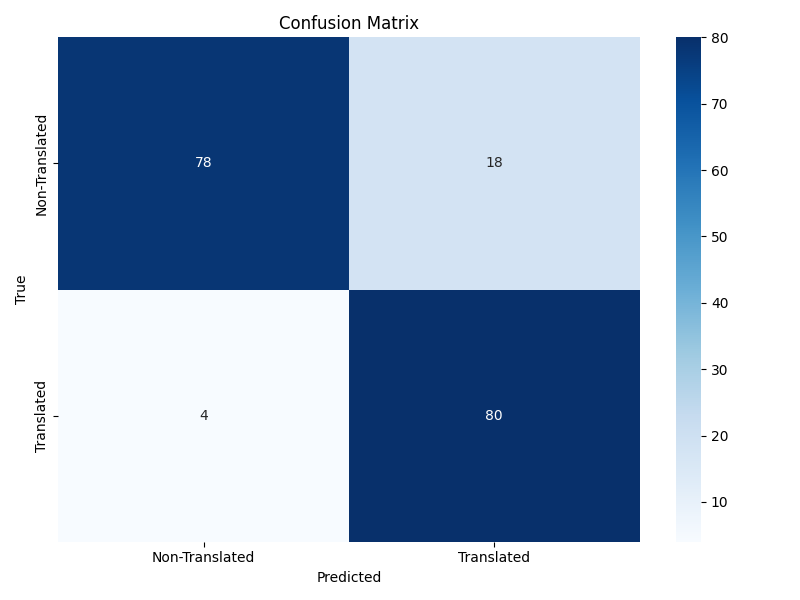
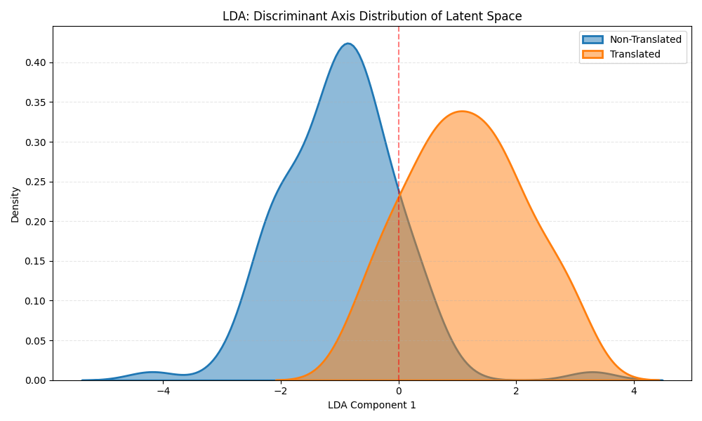
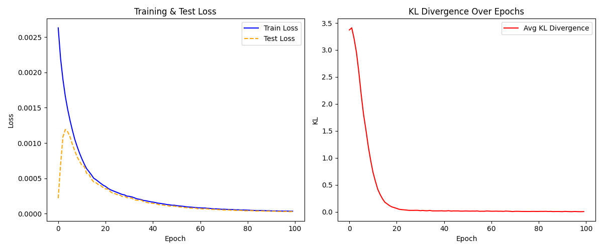

<h1 align="center"> Perturbation-based DL XAI for Stylistic Analysis</h1>

<p align="center">
  
  
  
  
</p>

<p align="center">
  A small research project for classifying translated and non-translated English texts and looking at why the model makes its decisions.
</p>

## What This Project Is

This repository is my implementation of a text classification workflow for stylistic analysis.

The main question is simple:

Can a model tell translated English apart from non-translated English?

To explore that question, the project does three things:

1. train a VAE with sentence embedding of translated and non-translated texts
2. classify the latent space vectors using three classifiers' majority vote based on stacked ensemble
3. conduct perturbation XAI

Besides the main VAE-based pipeline, the repository also keeps a TF-IDF baseline and a logistic regression baseline for comparison.

## What Is Included

This repository already contains:

- the main code
- processed datasets used by the current workflow
- several output figures and experiment artifacts

So if you just want to inspect the workflow or rerun parts of it, you do not need to rebuild everything from scratch first.

## Quick Start

Install dependencies:

```bash
uv sync
uv run python -m spacy download en_core_web_sm
```

Check that the CLI is available:

```bash
uv run xai-style check
```

## Data

If you have the original Excel file, place it here:

```text
data/raw/data.xlsx
```

The repository already includes these processed files:

- `data/processed/vae/processed_final.json`
- `data/processed/tfidf/processed_TFIDF_final.json`
- `data/processed/tfidf/feature_names.json`

If you want to regenerate them locally:

```bash
uv run xai-style fetch-sbert-model
uv run xai-style vae-preprocess
uv run xai-style tfidf-preprocess
```

The embedding model is `sentence-transformers/all-mpnet-base-v2`. If the local model is missing, preprocessing will download it automatically.

## Main Commands

### VAE Pipeline

```bash
uv run xai-style fetch-sbert-model
uv run xai-style vae-preprocess
uv run xai-style vae-train
uv run xai-style vae-search
uv run xai-style vae-vote
uv run xai-style vae-final
uv run xai-style vae-plot
uv run xai-style vae-perturb
uv run xai-style vae-importance
```

### Baselines

```bash
uv run xai-style vae-logistic
uv run xai-style vae-sbert-search
uv run xai-style vae-sbert-vote
uv run xai-style vae-sbert-final
uv run xai-style tfidf-preprocess
uv run xai-style tfidf-vote
```

## Example Outputs

These are some of the figures already generated by the project.

### Confusion Matrix

<p align="center">
  
</p>

### Latent-Space Distribution

<p align="center">
  
</p>

### VAE Training Curve

<p align="center">
  
</p>

## A Few Current Results

Some representative results from local runs:

| Experiment              |  Accuracy  | Output file                                             |
| :---------------------- | :--------: | :------------------------------------------------------ |
| VAE stacking            | **0.8778** | `outputs/vae/stacking_report.txt`                       |
| VAE logistic regression |   0.7200   | `outputs/vae/log_classification_report.txt`             |
| SBERT stacking          | **0.9778** | `outputs/vae/sbert_stacking_report_20260320_154645.txt` |

There are also interpretation-related outputs such as:

- `outputs/vae/perturbation_analysis.xlsx`
- `outputs/vae/perturbation_results.json`
- `outputs/vae/interpretation_report.json`

## Project Structure

```text
XAI for stylistic analysis/
├── assets/                          # Static assets and local models
├── data/                            # Raw and processed data
├── outputs/                         # Figures, reports, and model artifacts
├── tools/                           # Script entrypoints and wrappers
├── xai_for_stylistic_analysis/      # Main package
└── pyproject.toml                   # Project configuration
```

## Notes

- Python is pinned to `3.12` in `.python-version`.
- The local SBERT model directory can be large, so it may not be committed in every environment.
- Some outputs in `outputs/` are included mainly for demonstration and inspection.

## Acknowledgements

This project is inspired by research on translated vs. non-translated English, representation learning with VAE-style models, and explainable AI for text classification.

It also builds on open-source tools such as PyTorch, scikit-learn, sentence-transformers, spaCy, Hugging Face, and XGBoost.
